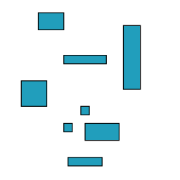
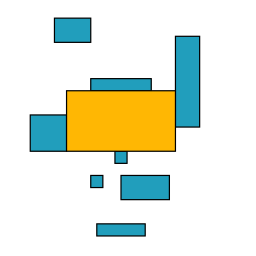
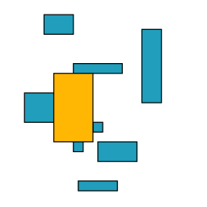
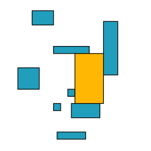
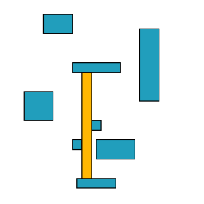
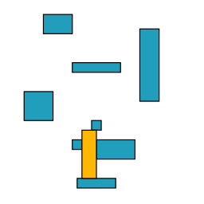

This code generates generates all _maximal empty rectangles_ (MERs) given a set of axis-aligned rectangular defects.
A rectangle is _empty_ if it does not contain any defect and is _maximal and empty_ if there is no other empty rectangle containing it.
More intuitively, a maximal empty rectangle is an empty rectangle that is delimited by defects.
(Sometimes I will refer to an MER as a _candidate_.)

For example, given the following defects:



we want to generate the following maximal empty rectangles:







## Code development

Testing:

```bash
pytest test
```
